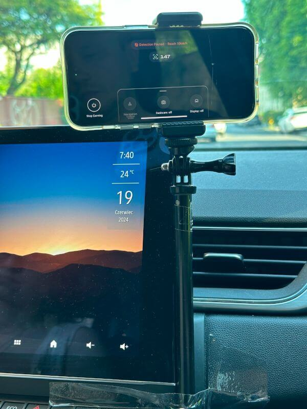
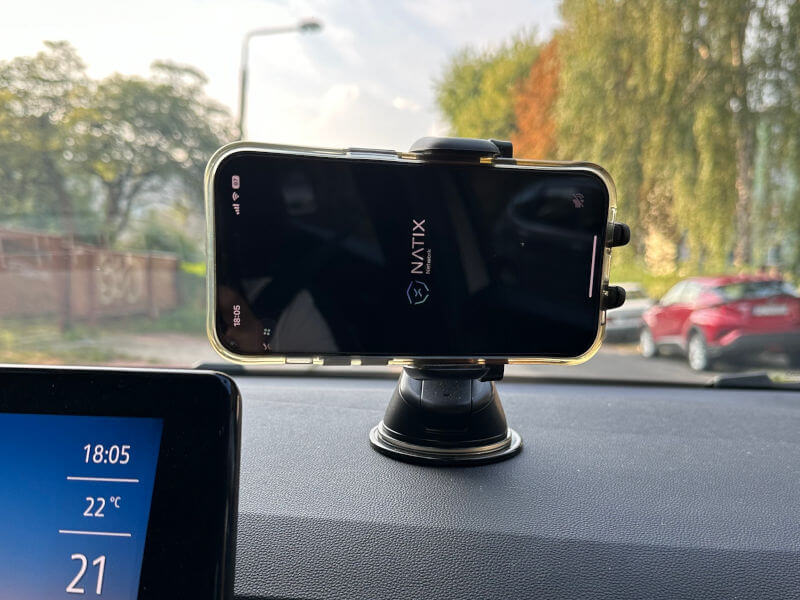
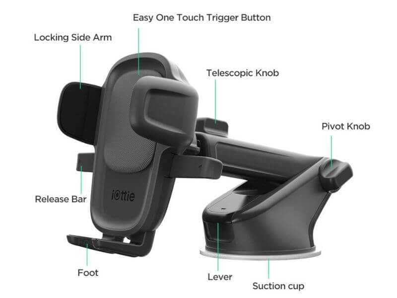

{:#learn.text-center}


**NATIX Network** is a decentralized platform that uses your smartphone camera to help build a live map of the world.
🌍
It turns everyday cameras into smart sensors, powered by AI.
🤖
This network is designed to collect real-time data about what's happening around us-like traffic, parking spots, or crowds.
🚗🚶‍♂️🅿️
NATIX Network ensures **privacy is protected**.
🛡️
Instead of sending video footage 🎥, it only gathers and shares anonymized metadata.
🔐
This way, no personal data is stored or shared.
🚫👤

By using the NATIX Drive& app, drivers collect metadata about traffic, infrastructure, and more as they drive.
🚗📊
For sending this data, they earn points.
🎯
The app also includes gamification elements, encouraging drivers to complete specific missions.
🏆
At the end of each month, the top 3000 drivers receive $NATIX tokens as a reward.
💰
These tokens can then be transferred to the Solana network for trading.
💸🔗

---

## My Journey with NATIX

I started using NATIX in late March 2024.
After installing the app, I took my first ride as a passenger, holding the phone in my hands.
📱
It was uncomfortable and clearly a temporary fix.
Since I'm cautious with new projects, I didn't want to buy a phone holder right away.

---

Instead, I improvised with a selfie stick and some tape.
🛠️
It was a makeshift solution, but better than holding the phone during the drive.

<div class="row">
  <div class="col-6 offset-3">
    
  </div>
</div>

---

In the first month, I didn't activate Nitro, so my results were poor.
🚫📉
Over the next few months, I improved my strategy and moved up the rankings.
📈
Eventually, I decided it was time to invest in a proper phone holder.
I researched thoroughly, looking for a model that wouldn't block my view and was easy to use.
🧐
I settled on the "iOttie Easy One Touch 5 Dash".
This setup has been perfect for me.
✅

<div class="row">
  <div class="col-6 offset-3">
    
  </div>
</div>

<div class="row">
  <div class="col-6 offset-3">
    
  </div>
</div>

---

When using the **NATIX Drive&** app, I keep a few things in mind.
First, earning $NATIX tokens 💰 isn't why I drive.
I drive to get where I need to go, and earning tokens is a nice bonus.
🚗✨
Second, there might be bugs in app or server issues.
🐞🔧
It's important not to get frustrated.
If the server has problems, it affects everyone the same way.
📉
Most importantly, safety comes first.
🛡️
I start the app before I begin my drive and turn it off when I arrive.
📱🚦
The app doesn't block my view.
I start my drive more calmly.
I stay within speed limits for better event detection.
🛣️
I use cruise control to maintain a steady speed.
🚀
Thanks to these habits, I noticed an extra benefit:
I use less fuel!
⛽️

What I regret most is joining the NATIX project so late.
😔
I know it's a valuable project with a low barrier to entry.
🚀📱
All you need to do is install the NATIX Drive& app on your phone - there's no need to buy any extra devices.
🔧

---

{:#start}
## Join the NATIX Network

To start earning, all you need to do is install the "NATIX Drive&" app on your smartphone.
📱💰
The app is available on the App Store for iPhone and Google Play for Android.
🛒
During the first launch, you'll create an account.
If you use referral codes, you can get a sign-up bonus of 350 points to kickstart your journey.
🎉🚀
Here are my referral codes for you to use:
<!-- NATIX-REFERRAL-CODES-LIST:START -->
```
JkN3+xGeD5
```

```
6RdM61me7+
```

```
d7ZuMRcYkY
```

```
SMK#GZwg9Z
```
<!-- NATIX-REFERRAL-CODES-LIST:END -->
<!--
_All referral codes this week have been used.
Come back on Sunday for new refcodes._
-->

---

## My ranking by month

The more the worse.

<canvas class="my-4 w-100" id="results" width="900" height="380"></canvas>
<script src="https://cdn.jsdelivr.net/npm/chart.js@4.4.4/dist/chart.umd.min.js"></script>
<script>
(() => {
  'use strict'

  const DATES   = ['2024.03', '2024.04', '2024.05', '2024.06', '2024.07', '2024.08', '2024.09', '2024.10', '2024.11', '2024.12', '2025.01', '2025.02', '2025.03', '2025.04', '2025.05', '2025.06', '2025.07', '2025.08', '2025.09', '2025.10'];
  const RESULTS = [ 401,       144,       67,        79,        47,        66,        87,        80,        61,        50,        61,       57,         47,        96,        53,        66,        114,       62,        80,       148];

  // Graphs
  const ctx = document.getElementById('results')
  // eslint-disable-next-line no-unused-vars
  const chart = new Chart(ctx, {
    type: 'bar',
    data: {
      labels: DATES,
      datasets: [{
        data: RESULTS
      }]
    },
    options: {
      plugins: {
        legend: {
          display: false
        },
        tooltip: {
          boxPadding: 4
        }
      }
    }
  })
})();
</script>

---

For more details, I highly recommend checking out the official [NATIX Network website](https://www.natix.network/)
🌐
and the [NATIX Network Blog](https://www.natix.network/blog).
📝
There's a wealth of valuable information that can help you better understand the project and avoid unnecessary questions.
🔍
